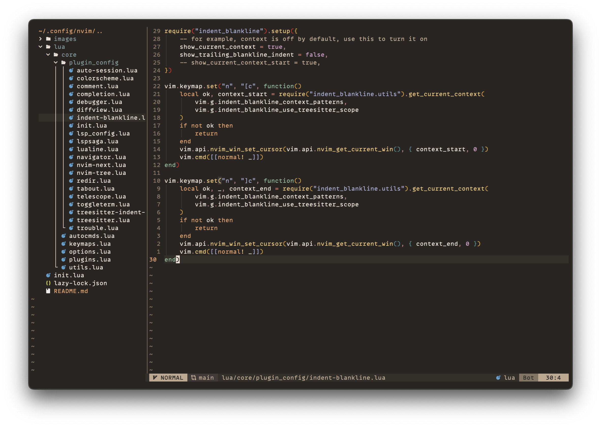
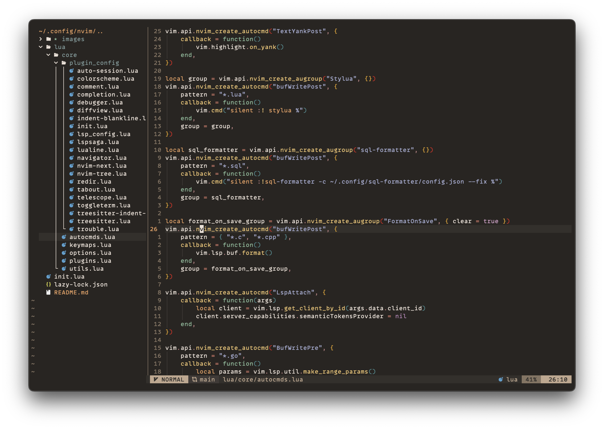

# Neovim Config




## How to setup

Backup or delete your current nvim config

```
mv ~/.config/nvim ~/.config/nvim.backup # to backup the current config
rm -rf ~/.config/nvim # to delete the current config
```

Create the nvim config directory

```
mkdir -p ~/.config/nvim
```

clone the repo

```
git clone https://github.com/parmardiwakar150/neovim-config.git ~/.config/nvim
```
